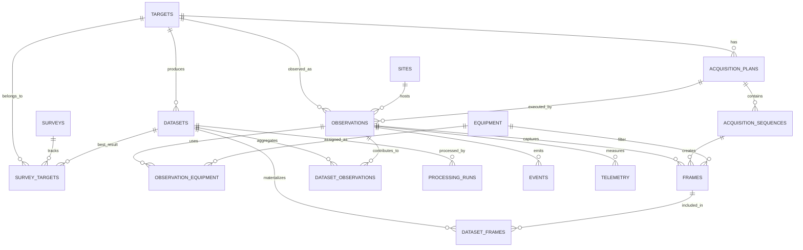

# TSN Deep Space System v0.1 — ERD

## Core idea

Najważniejszy artefakt v0.1 to `dataset`, nie finalny obraz.

- `dataset_observations` opisuje pochodzenie materiału z sesji
- `dataset_frames` opisuje dokładny skład datasetu
- `processing_runs` pozwalają wielokrotnie przetwarzać ten sam dataset

To rozdzielenie jest kluczowe dla odtwarzalności workflow.
